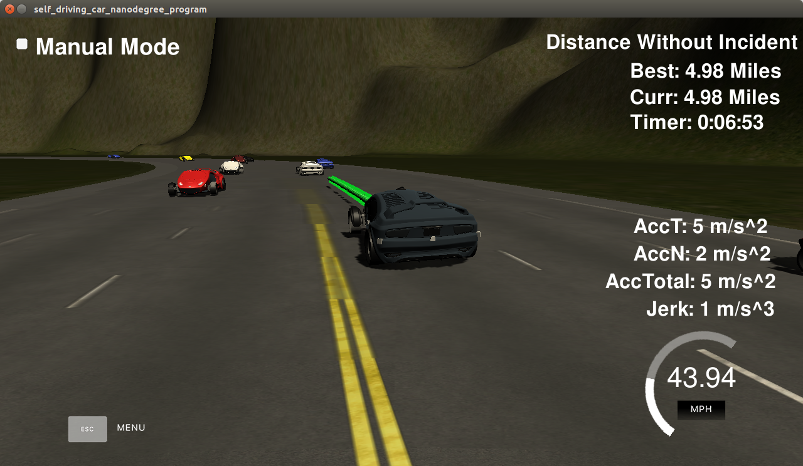
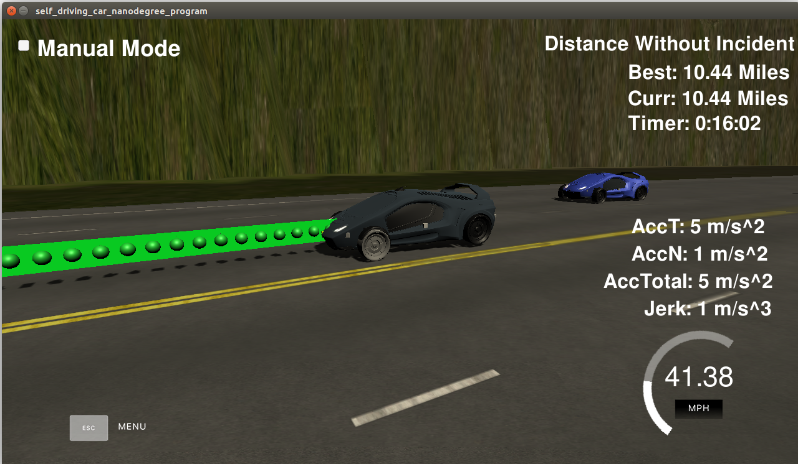
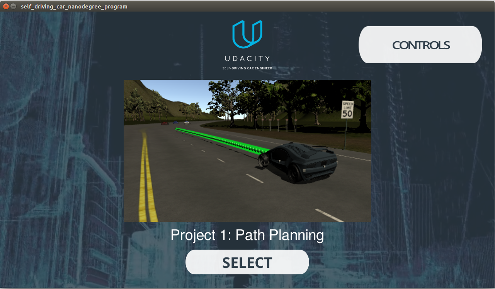

# CarND-Path-Planning-Project
Self-Driving Car Engineer Nanodegree Program


   
## Problem Overview
The goals of the project are as follows
1. The Ego car should safely navigate around a virtual highway with other traffic that is driving +-10 MPH of the 50 MPH speed limit. 
2. The car's localization and sensor fusion data as well as a sparse map list of waypoints around the highway is provided. The car should try to go as close as possible to the 50 MPH speed limit, which means passing slower traffic when possible, while the other cars will try to change lanes too. 
3. The car should avoid hitting other cars at all cost as well as driving inside of the marked road lanes at all times, unless going from one lane to another. 
4. The car should be able to make one complete loop around the 6946m highway. Since the car is trying to go 50 MPH, it should take a little over 5 minutes to complete 1 loop. 
5. The car should not experience total acceleration over 10 m/s^2 and jerk that is greater than 10 m/s^3.
Thus, we need to implement a path planning algorithms to drive a car on a highway on a simulator provided by Udacity.

## The map of the highway (data/highway_map.txt)
Each waypoint in the list contains  [x,y,s,dx,dy] values. x and y are the waypoint's map coordinate position, the s value is the distance along the road to get to that waypoint in meters, the dx and dy values define the unit normal vector pointing outward of the highway loop.

The highway's waypoints loop around so the frenet s value, distance along the road, goes from 0 to 6945.554.

## Basic Build Instructions

1. Clone this repo.
2. Make a build directory: `mkdir build && cd build`
3. Compile: `cmake .. && make`
4. Run it: `./path_planning`.

## Data provided from the Simulator.

#### Main car's localization Data (No Noise)

["x"] The car's x position in map coordinates

["y"] The car's y position in map coordinates

["s"] The car's s position in frenet coordinates

["d"] The car's d position in frenet coordinates

["yaw"] The car's yaw angle in the map

["speed"] The car's speed in MPH

#### Previous path data given to the Planner

//Note: Return the previous list but with processed points removed, can be a nice tool to show how far along
the path has processed since last time. 

["previous_path_x"] The previous list of x points previously given to the simulator

["previous_path_y"] The previous list of y points previously given to the simulator

#### Previous path's end s and d values 

["end_path_s"] The previous list's last point's frenet s value

["end_path_d"] The previous list's last point's frenet d value

#### Sensor Fusion Data, a list of all other car's attributes on the same side of the road. (No Noise)

["sensor_fusion"] A 2d vector of cars and then that car's [car's unique ID, car's x position in map coordinates, car's y position in map coordinates, car's x velocity in m/s, car's y velocity in m/s, car's s position in frenet coordinates, car's d position in frenet coordinates. 

## Details

1. The car uses a perfect controller and will visit every (x,y) point it recieves in the list every .02 seconds. The units for the (x,y) points are in meters and the spacing of the points determines the speed of the car. The vector going from a point to the next point in the list dictates the angle of the car. Acceleration both in the tangential and normal directions is measured along with the jerk, the rate of change of total Acceleration. The (x,y) point paths that the planner recieves should not have a total acceleration that goes over 10 m/s^2, also the jerk should not go over 50 m/s^3. (NOTE: As this is BETA, these requirements might change. Also currently jerk is over a .02 second interval, it would probably be better to average total acceleration over 1 second and measure jerk from that.

2. There will be some latency between the simulator running and the path planner returning a path, with optimized code usually its not very long maybe just 1-3 time steps. During this delay the simulator will continue using points that it was last given, because of this its a good idea to store the last points you have used so you can have a smooth transition. previous_path_x, and previous_path_y can be helpful for this transition since they show the last points given to the simulator controller with the processed points already removed. You would either return a path that extends this previous path or make sure to create a new path that has a smooth transition with this last path.

--

## Dependencies

* cmake >= 3.5
  * All OSes: [click here for installation instructions](https://cmake.org/install/)
* make >= 4.1
  * Linux: make is installed by default on most Linux distros
  * Mac: [install Xcode command line tools to get make](https://developer.apple.com/xcode/features/)
  * Windows: [Click here for installation instructions](http://gnuwin32.sourceforge.net/packages/make.htm)
* gcc/g++ >= 5.4
  * Linux: gcc / g++ is installed by default on most Linux distros
  * Mac: same deal as make - [install Xcode command line tools]((https://developer.apple.com/xcode/features/)
  * Windows: recommend using [MinGW](http://www.mingw.org/)
* [uWebSockets](https://github.com/uWebSockets/uWebSockets)
  * Run either `install-mac.sh` or `install-ubuntu.sh`.
  * If you install from source, checkout to commit `e94b6e1`, i.e.
    ```
    git clone https://github.com/uWebSockets/uWebSockets 
    cd uWebSockets
    git checkout e94b6e1
    ```
## Project Specification


##Compilation

#### The code compiles correctly.
	
##### Code compile without errors with cmake and make.

The header file Spline.h is added without any other changes in the cmake configuration and the code compiles without any error.


## Valid Trajectories

#### The car is able to drive at least 4.32 miles without incident.
	
The car was run for more then 10 miles without any incident.





#### The car drives according to the speed limit.
	
The car doesn't drive faster than the speed limit. Also the car isn't driving much slower than speed limit unless obstructed by traffic.

#### Max Acceleration and Jerk are not Exceeded.
	
The car does not exceed a total acceleration of 10 m/s^2 and a jerk of 10 m/s^3. Thus there were no warning messages displayed.

#### Car does not have collisions.
	
The car does not come into contact with any of the other cars on the road.

#### The car stays in its lane, except for the time between changing lanes.
	
The car doesn't spend more than a 3 second length out side the lane lanes during changing lanes, and every other time the car stays inside one of the 3 lanes on the right hand side of the road.

#### The car is able to change lanes
	

The car is able to smoothly change lanes when it makes sense to do so, such as when behind a slower moving car and an adjacent lane is clear of other traffic.

## Reflection

To start the project the following the steps are followed.
* The simulator is downloaded.([the simulator could be downloaded here](https://github.com/udacity/self-driving-car-sim/releases/tag/T3_v1.2)).



* The project is cloned.([here](https://github.com/udacity/CarND-Path-Planning-Project)).

* The car transmits its location, along with its sensor fusion data, which estimates the location of all the vehicles on the same side of the road.

* The path planner outputs a list of x and y global map coordinates. Each pair of x and y coordinates is a point, and all of the points together form a trajectory. Since initially the there is nothing passed to the next_x,next_y variables (src/main.cpp line 467,468) the car remains unmoved initially.

* The project is now approached by considering the following parts.

### Trajectory Generation [line 344 to line 470](./src/main.cpp#L344)

This part of the code computes the trajectory of the car based on the behaviour planning done. Before implemeting this code the car would not move in the simulator. To start with (as per the project walkthrough) 50 points were generated which made the car move in the simulator. To keep the car in track the XY coordinate is converted to Frenet co-ordinate and the car starts moving.

Now the last two points of the previous trajectory or the car position (lines 370 to 387: if the previous size is almost empty) and three other points (lines 394 to 400 :30m spaced points ahead of the starting refrence) are pushed and used to create a spline. Calculation is done to break up spline points so that we travel at the deired refrence velocity.(lines 431 to 433).

To maintain continuity we start with the previous path points from the last time (lines 423 to 428) and fill up the rest of our path planner and the speed is maintained based on the speed decided by the behaviour planner(lines 439 to 446). 

### Prediction step [line 265 to line 311](./src/main.cpp#L265)  

After working on the trajectory generator this part of the code was developed to use the sensor fusion data available from the simulator. We go through all the cars in the visinity of the ego car and categorise three aspects of the cars.
 * Car_ahead (if the car is ahead and less the 30m blocking the ego car)
 * Car_left (if the car to the left is close and left turn shoud be avoided)
 * Car_right (if the car to the right is close abd right turn should be avoided)
Firstly the lane of the car is calculated based on the d frenet coordinate.(lines 227 to 229), the speed of the car is calculated (lines 292 to 295), then the S position of the car is checked for kess then 30 m.(lines 298 to 309)  

### Behavior Planning [line 313 to line 340](./src/main.cpp#L313)

Finally the code to actualy decide the behavior of the veicle is developed to check for different scenarios and make a decision. If the car is infront of us and blocking the ego car , the car car decides whether a right or a left lane change is safe or else it remains in the same lane and reduce the speed unless its safe to change the lane(lines 321 to 330). 
In case of no car blocking the speed of the car is maintained on the speed limit and the lane is maintained in the original lane 0.(lines 331 to 340) 


 


  


